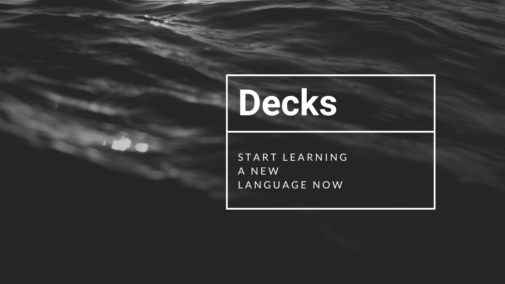

# Decks <!-- ALL-CONTRIBUTORS-BADGE:START - Do not remove or modify this section -->

<!-- ALL-CONTRIBUTORS-BADGE:END -->

Decks is an web application that allows users to generate and share their own digital flash cards and practice learning them in a fun, intuitive way with their friends.

The app was written entirely in Typescript and was developed by a team of 3 developers who are mentioned below. 👱‍♂️🧔👩

## Tech Stack 🖥

- Typescript
- React
- Redux
- Express.js
- PostgreSQL
- Firebase

## Installation Guide ⌨️

1. Fork and clone this repo
2. Run `npm install` in the client folder
3. Run `npm install` in the server folder
4. In the server folder, run `node index.ts`
5. In the client folder, run `npm start` and the application will launch in your browser

## Contributors 🐾

<!-- ALL-CONTRIBUTORS-LIST:START - Do not remove or modify this section -->
<!-- prettier-ignore-start -->
<!-- markdownlint-disable -->
<table>
  <tr>
    <td align="center"><a href="https://www.linkedin.com/in/carlaastrain/"> <b>Carla Astrain </b></a> <a href="https://github.com/smartin88/Decks/commits?author=carlaastrain" title="Code">💻</a> <a href="#design-carlaastrain" title="Design">🎨</a></td>
    <td align="center"><a href="https://www.linkedin.com/in/shaun-martin-5860ba45/"> <b>Shaun Martin</b></a> <a href="https://github.com/smartin88/Decks/commits?author=smartin88" title="Code">💻</a> <a href="#design-smartin88" title="Design">🎨</a></td>
    <td align="center"><a href="https://www.linkedin.com/in/draguhn/"> <b>Max Draguhn</b></a> <a href="https://github.com/smartin88/Decks/commits?author=draguhn" title="Code">💻</a> <a href="#design-draguhn" title="Design">🎨</a></td>
  </tr>
</table>

<!-- markdownlint-restore -->
<!-- prettier-ignore-end -->

<!-- ALL-CONTRIBUTORS-LIST:END -->

