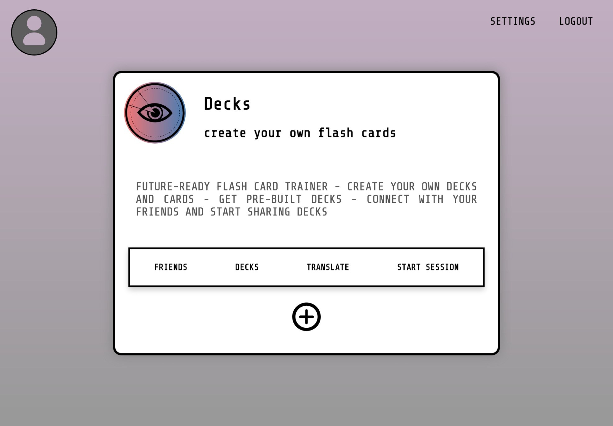

# Decks 

Decks is an web application that allows users to generate and share their own digital flash cards and practice learning them in a fun, intuitive way with their friends.

The app was written entirely in Typescript and was developed by a team of 3 developers who are mentioned below. 👱‍♂️🧔👩

## Tech Stack 🖥

- Typescript
- React
- Redux
- Express.js
- PostgreSQL
- Firebase

## Installation Guide ⌨️

1. Fork and clone this repo
2. Run `npm install` in the client folder
3. Run `npm install` in the server folder
4. In the server folder, run `node index.ts`
5. In the client folder, run `npm start` and the application will launch in your browser

## Contributors 🐾

